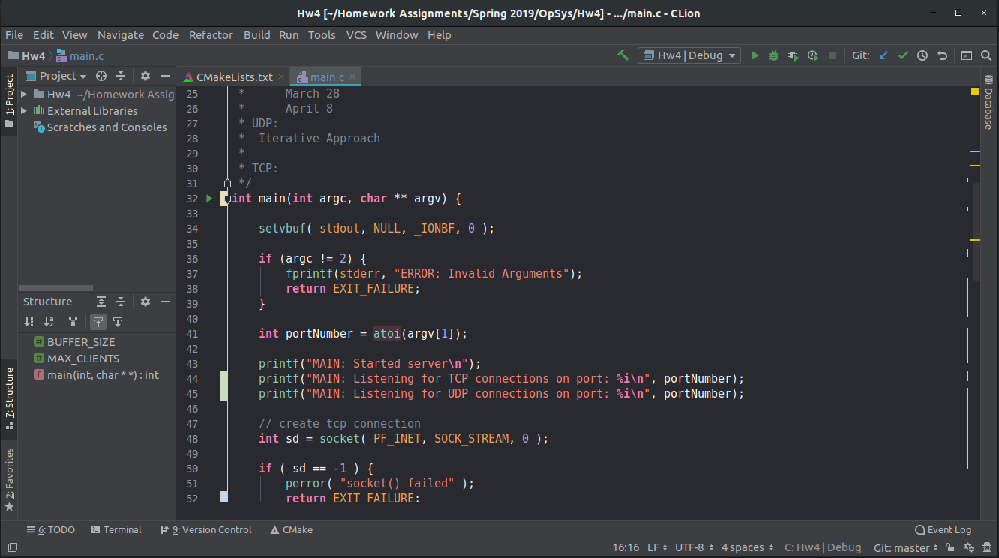

# Xcode Dark Color Scheme 
This is a dark color scheme for JetBrains IDEs, based on Apple's dark-schemed editor in Xcode 10.
* Currently works well for C/C++ and Python.

## Installation
1. Go to `Settings` -> `Editor` -> `Color Scheme`
2. Then import the `XcodeDark.icls` file into the IDE by clicking on the gear icon.

### Thanks for viewing!
